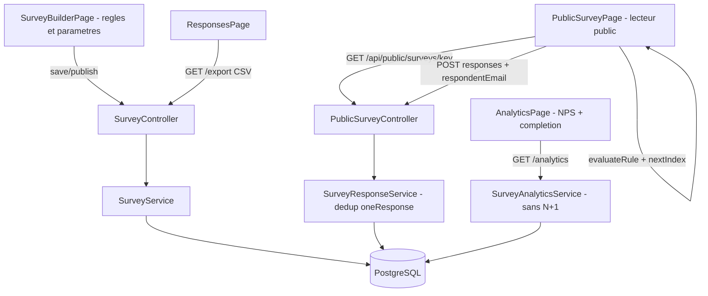

# État des lieux

### Où vous en êtes — analyse complète du code

Votre projet est **déjà un module d'enquête fonctionnel de bout en bout**, très proche du modèle Intercom Surveys (cité dans `README_INTERCOM_REFERENCE.md`). Estimation : **~80 % du cœur fonctionnel est fait**.

#### ✅ Backend Spring Boot 4 / Java 21 — quasi complet

| Domaine | État | Fichiers |
|---|---|---|
| Modèle de données | ✅ Complet | `Survey`, `SurveyQuestion`, `SurveyLogicRule`, `SurveyResponse`, `SurveyDeliveryEvent`, `CustomerProfile`, `User` |
| CRUD + cycle de vie | ✅ Complet | `SurveyController` : create/update/draft/publish/pause/resume/archive/duplicate/delete |
| Enquête publique | ✅ Complet | `PublicSurveyController` : lecture par `publicKey`, événement VIEWED, soumission de réponses |
| Déclencheurs | ✅ Complet | `TriggerController` : page-visit, time-on-page, API event, audience-entry, manuel + `SurveyScheduler` (activation `Programmée` → `Active` toutes les 60 s) |
| Audiences | ✅ Complet | `AudienceController` + `AudienceService` : options depuis `customer_profiles`, préview avec filtres |
| Analytics | ⚠️ Fonctionnel mais N+1 | `SurveyAnalyticsService` : vues, réponses, taux, série 14 jours, distribution par question — mais recharge toutes les réponses **pour chaque question** |
| Auth | ✅ Complet | Session serveur, login classique + Google OAuth2 (`SecurityConfig`, `GoogleOAuth2SuccessHandler`) |

#### ✅ Frontend React 19 / Vite / TypeScript — quasi complet

(Remarque : les fichiers paraissent vides car écrits en style ultra-compressé — une ligne par composant — mais tout le contenu y est.)

| Page | État |
|---|---|
| `HomePage` (marketing) + `HelpPage` | ✅ Complets et stylés (`marketing.css`, `Help.css`) |
| `SurveyBuilderPage` (8 étapes : Infos → Questions → Logique → Aperçu → Déclenchement → Audience → Diffusion → Paramètres) | ✅ Complet, 8 types de questions |
| `SurveysPage`, `DashboardPage`, `ResponsesPage`, `AnalyticsPage` | ✅ Complets |
| `PublicSurveyPage` (lecteur public) | ⚠️ Fonctionnel mais **ignore la logique et les paramètres** |
| Auth (`IdentificationPage`, `RegistrationPage`, `ProfilePage`, `SettingsPage`) | ✅ Complets |

#### ❌ Les 4 écarts restants vs Intercom Surveys

1. **Logique de branchement non appliquée** : les règles `BRANCH`/`DISPLAY` sont créées dans le builder et stockées en base (`survey_logic_rules`), mais `PublicSurveyPage.tsx` navigue séquentiellement (`setIndex(index+1)`) sans jamais les évaluer.
2. **Paramètres non appliqués côté public** : `welcome` (écran de bienvenue), `collectEmail` (collecte d'email) et `oneResponse` (une seule réponse par client) sont configurables mais ignorés par le lecteur public et par `SurveyResponseService.submit()`.
3. **Exports & analytics** : pas d'export CSV des réponses ; N+1 dans `SurveyAnalyticsService` ; pas de score NPS ni de taux de complétion.
4. **Sécurité & qualité** : mot de passe PostgreSQL et client-secret Google **en clair** dans `application.properties` (lignes 6 et 20 — à régénérer car compromis) ; **aucun test** (`src/test` inexistant alors que les dépendances de test sont déjà dans `build.gradle`).

# Technical Design

### Proposed Changes

#### 1. Logique de branchement dans le lecteur public

**Fichier : `enquete-client-frontend--/src/pages/PublicSurveyPage.tsx`** (+ types dans `types.ts` si besoin)

- Nouvelle fonction pure `evaluateRule(rule: LogicRule, answer: unknown): boolean` supportant les opérateurs du builder (`EQUALS`, `NOT_EQUALS`, comparaisons numériques `GREATER`/`LESS` si présents dans `LogicStep`).
- Navigation :
  - `BRANCH` : après réponse à la question `sourceIndex`, si la condition matche → sauter à `targetIndex` ; sinon question visible suivante.
  - `DISPLAY` : la question `targetIndex` n'est affichée que si la condition sur la réponse de `sourceIndex` est satisfaite ; sinon elle est sautée.
- Remplacement de `setIndex(index+1)` par `nextIndex(index, answers, logicRules)` ; les questions sautées ne sont pas comptées dans la progression.
- Fin d'enquête : si un `BRANCH` pointe au-delà de la dernière question visible → soumission.

```ts
function nextIndex(current:number, answers:Record<string,unknown>, rules:LogicRule[], total:number):number|'END'
```

#### 2. Application des paramètres d'enquête

**Frontend `PublicSurveyPage.tsx`** :
- `settings.welcome` → écran de bienvenue (titre + description + bouton « Commencer ») avant la 1ʳᵉ question.
- `settings.collectEmail` → champ email sur l'écran final avant envoi (requis si `anonymous=false`).
- `settings.oneResponse` → marqueur `localStorage` `survey_done_<publicKey>` + gestion du refus backend (message « Vous avez déjà répondu »).

**Backend** :
- `SurveyResponse.java` : nouvelle colonne `respondent_email` (String, nullable) — créée automatiquement par `ddl-auto=update`.
- `SurveyResponseService.SubmitRequest` : champ `respondentEmail`.
- `SurveyResponseService.submit()` : si `settings.oneResponse=true` et email fourni → rejet `409` si une réponse existe déjà pour ce couple (nouvelle méthode `existsBySurveyAndRespondentEmailIgnoreCase` dans `SurveyResponseRepository`).
- `ResponseView` enrichi avec `respondentEmail` pour affichage dans `ResponsesPage`.

#### 3. Export CSV + analytics

**Backend** :
- `SurveyController` : `GET /api/surveys/{id}/export` → `text/csv` (BOM UTF-8 pour Excel). Colonnes : `id`, `date`, `anonyme`, `client`, `email`, puis une colonne par question (titre). Génération dans `SurveyResponseService.exportCsv(...)`.
- `SurveyAnalyticsService` : correction du N+1 — charger `findAllBySurveyOrderByCompletedAtDesc` **une seule fois** et le passer à `analyzeQuestion`.
- Nouveaux champs dans le record `Analytics` : `npsScore` (promoteurs 9-10 − détracteurs 0-6, sur la 1ʳᵉ question NPS) et `completionRate`.

**Frontend** :
- Bouton « Exporter CSV » dans `ResponsesPage.tsx` (lien direct vers l'endpoint).
- Affichage du score NPS dans `AnalyticsPage.tsx` (mise à jour du type `Analytics` dans `types.ts`).

#### 4. Sécurité & tests

- `application.properties` : remplacer les secrets par des variables d'environnement :
  ```properties
  spring.datasource.password=${DB_PASSWORD:}
  spring.security.oauth2.client.registration.google.client-id=${GOOGLE_CLIENT_ID:}
  spring.security.oauth2.client.registration.google.client-secret=${GOOGLE_CLIENT_SECRET:}
  ```
  + note dans `README_AFRILAND_FINAL.md` (⚠️ le client-secret actuel est exposé : à **régénérer** dans Google Cloud Console).
- Création de `src/test/java/cm/afriland/enquete/` avec tests JUnit (dépendances déjà présentes dans `build.gradle`) :
  - `SurveyServiceTest` : validations create/publish (question obligatoire, canal obligatoire), statut `Programmée` vs `Active` selon `DATE_TIME`.
  - `SurveyResponseServiceTest` : soumission valide, rejet enquête non active, dédoublonnage `oneResponse`.
  - `SurveyAnalyticsServiceTest` : distribution, moyenne, score NPS.

### Architecture Diagram



### Risks

- **Règles de logique incohérentes** (cycles, cibles supprimées) : l'évaluateur ignore les règles dont les index sont hors bornes (déjà filtrées côté backend dans `SurveyService.apply`).
- **`oneResponse` contournable** sans email (localStorage effaçable) : limitation acceptée, identique au comportement « best effort » des outils du marché sans identification forte.
- **`ddl-auto=update`** ajoutera la colonne `respondent_email` automatiquement — aucun script de migration requis.
- Style de code frontend ultra-compressé : les modifications resteront cohérentes avec le style existant du fichier.

# Testing

### Validation Approach

Compilation backend (`gradlew.bat build -x test` puis avec tests), typage frontend (`npx tsc --noEmit`), et vérification manuelle des parcours via l'application lancée (backend 8080 + Vite 5173).

### Key Scenarios

1. **Branchement** : enquête à 3 questions avec règle `BRANCH` (Q1 = 10 → Q3) : répondre 10 saute Q2 ; répondre 5 passe par Q2.
2. **Affichage conditionnel** : règle `DISPLAY` — la question cible n'apparaît que si la condition est vraie.
3. **Écran de bienvenue** : affiché uniquement si `settings.welcome = true`.
4. **Collecte email** : champ requis avant envoi si `collectEmail = true` et réponse non anonyme.
5. **Une seule réponse** : deuxième soumission avec le même email → `409` + message clair ; marqueur localStorage empêche la ré-ouverture.
6. **Export CSV** : fichier téléchargé avec une colonne par question et encodage lisible dans Excel.
7. **Analytics** : `npsScore` et `completionRate` cohérents avec les réponses en base ; 1 seule requête de chargement des réponses.

### Edge Cases

- Enquête sans règles de logique → navigation séquentielle inchangée (non-régression).
- Règle pointant vers une question supprimée → ignorée sans erreur.
- Réponse anonyme avec `collectEmail = true` → email non exigé.
- Export CSV d'une enquête sans réponses → fichier avec en-têtes uniquement.
- Démarrage backend sans variables d'environnement → message d'erreur clair (valeurs par défaut vides documentées).

### Test Changes

- Nouveaux tests backend : `SurveyServiceTest`, `SurveyResponseServiceTest`, `SurveyAnalyticsServiceTest` dans `src/test/java/cm/afriland/enquete/`.
- Pas d'infrastructure de test frontend ajoutée (hors périmètre) : la logique `evaluateRule`/`nextIndex` sera écrite en fonctions pures pour rester testable ultérieurement.

# Delivery Steps

###   Step 1: Appliquer la logique de branchement dans le lecteur public
Le lecteur public respecte les règles BRANCH et DISPLAY définies dans le builder.

- Ajouter les fonctions pures `evaluateRule()` et `nextIndex()` dans `PublicSurveyPage.tsx` (opérateurs alignés sur ceux du builder : EQUALS, NOT_EQUALS, comparaisons numériques).
- Remplacer la navigation séquentielle `setIndex(index+1)` par la navigation pilotée par les règles.
- Sauter les questions masquées par `DISPLAY` et gérer la fin d'enquête anticipée via `BRANCH`.
- Adapter la barre de progression au parcours réel (questions sautées non comptées).
- Vérifier la non-régression sur une enquête sans règles (navigation séquentielle).

###   Step 2: Appliquer les paramètres d'enquête côté public et backend
Les paramètres `welcome`, `collectEmail` et `oneResponse` sont réellement appliqués lors de la réponse.

- Ajouter l'écran de bienvenue conditionnel (`settings.welcome`) dans `PublicSurveyPage.tsx`.
- Ajouter le champ email final (`settings.collectEmail`, requis si non anonyme) et l'envoyer dans la soumission.
- Ajouter la colonne `respondent_email` à `SurveyResponse.java` et le champ `respondentEmail` à `SubmitRequest`.
- Implémenter le dédoublonnage `oneResponse` dans `SurveyResponseService.submit()` (rejet 409 via `existsBySurveyAndRespondentEmailIgnoreCase` dans `SurveyResponseRepository`) + marqueur localStorage côté frontend.
- Afficher l'email du répondant dans `ResponsesPage.tsx` (enrichir `ResponseView`).

###   Step 3: Ajouter l'export CSV et enrichir les analytics
Les réponses sont exportables en CSV et les analytics affichent le score NPS et le taux de complétion sans N+1.

- Créer `GET /api/surveys/{id}/export` dans `SurveyController` (CSV UTF-8 avec BOM, une colonne par question) avec génération dans `SurveyResponseService`.
- Corriger le N+1 de `SurveyAnalyticsService` : charger les réponses une seule fois pour toutes les questions.
- Ajouter `npsScore` et `completionRate` au record `Analytics` (et au type `Analytics` dans `types.ts`).
- Ajouter le bouton « Exporter CSV » dans `ResponsesPage.tsx` et l'affichage NPS dans `AnalyticsPage.tsx`.

###   Step 4: Externaliser les secrets et créer la base de tests
Les secrets ne sont plus en clair et les services critiques du backend sont couverts par des tests JUnit.

- Remplacer le mot de passe PostgreSQL et les identifiants Google OAuth2 par des variables d'environnement (`${DB_PASSWORD}`, `${GOOGLE_CLIENT_ID}`, `${GOOGLE_CLIENT_SECRET}`) dans `application.properties`.
- Documenter dans `README_AFRILAND_FINAL.md` les variables requises et l'obligation de régénérer le client-secret Google exposé.
- Créer `src/test/java/cm/afriland/enquete/` avec `SurveyServiceTest` (validations publish, statut Programmée/Active), `SurveyResponseServiceTest` (soumission, enquête inactive, dédoublonnage `oneResponse`) et `SurveyAnalyticsServiceTest` (distribution, moyenne, NPS).
- Exécuter `gradlew.bat test` et corriger jusqu'au vert.